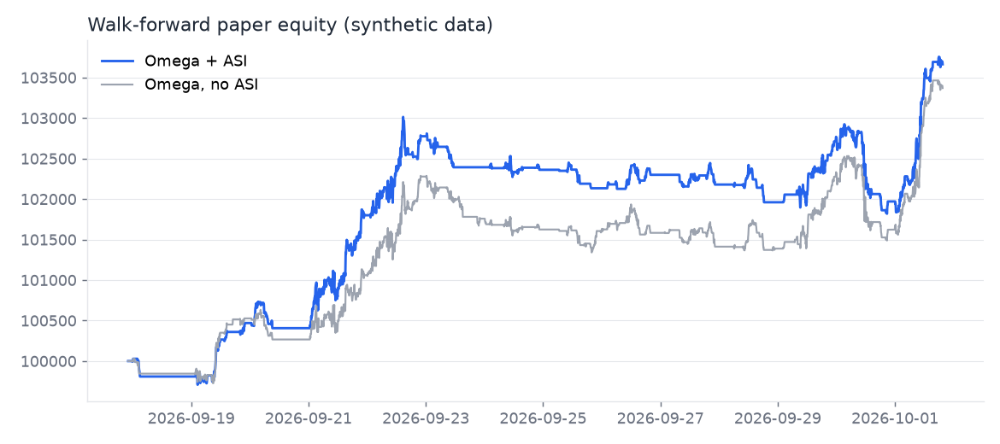
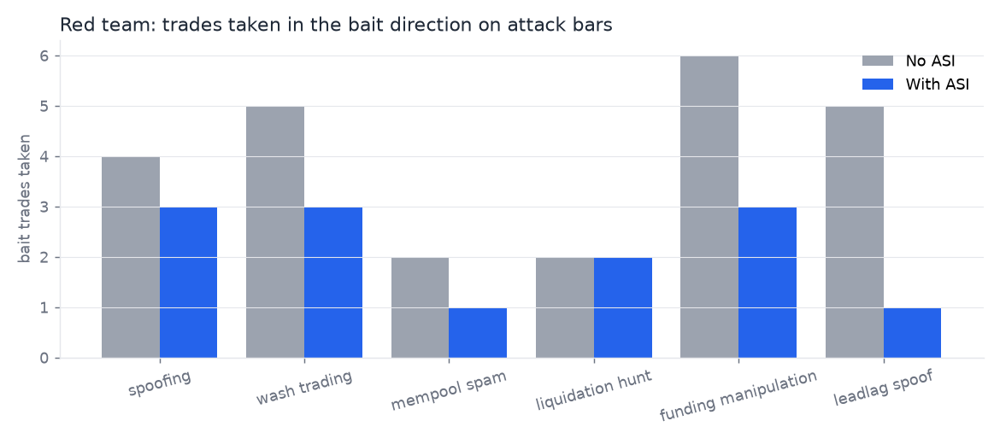
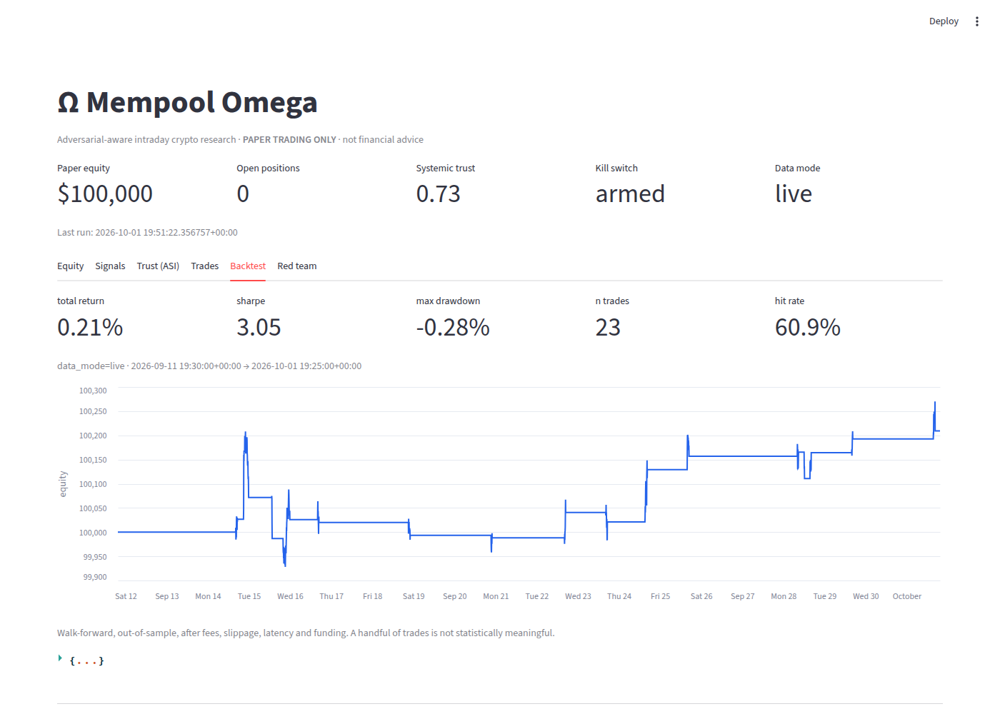
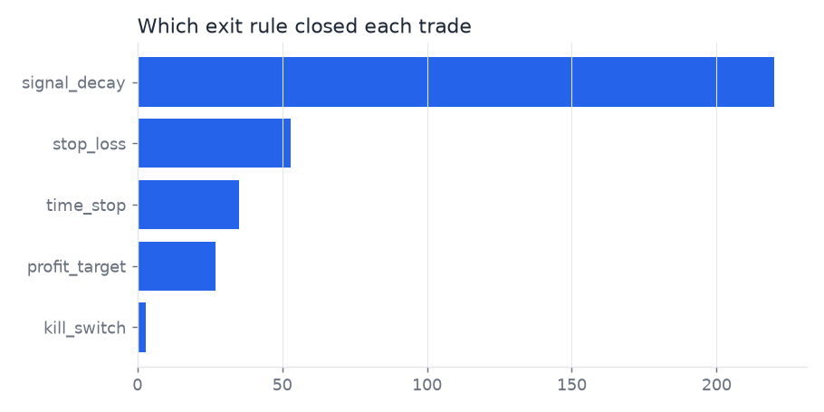

# Ω Mempool Omega

**A zero-cost, GitHub-native, adversarial-aware intraday crypto research & PAPER-trading engine.**

It reads only free, public market and on-chain data. It computes 35 microstructure and on-chain signals, scores
how much each one can be trusted (manipulation-aware), and trades on paper only when the expected edge beats costs
*plus* a manipulation premium. The whole thing runs on GitHub Actions: hourly paper trading, nightly retraining, and
a ledger committed back to the repo.

> ⚠️ **Paper trading only. Not financial advice. No profit is promised.** See [LEGAL.md](LEGAL.md).

## 👋 Start here (no market knowledge needed)
- **This hour's top 5 coin ideas, explained in plain English:** [state/suggestions/LATEST.md](state/suggestions/LATEST.md)
- **How past ideas actually turned out:** [state/suggestions/scoreboard.json](state/suggestions/scoreboard.json) (or the dashboard's *Track record* tab)
- **What everything means:** [docs/BEGINNERS_GUIDE.md](docs/BEGINNERS_GUIDE.md)

Every hour the scanner ranks ~60 of the most-traded coins and lists 5 *buy* ideas. Each one has a score out of 10, a risk level, a take-profit price, a safety-exit price, a 24-hour time limit and the reasons it was picked. Every idea is checked afterwards, so you can judge the scanner by results.



---

## What the "100x" goals mean, and how they're measured

| Goal | What we actually do | How to check |
|------|---------------------|--------------|
| **100x lower infra cost** | $0/month: GitHub Actions free tier, public endpoints, Streamlit Community Cloud, Telegram. No servers, databases or paid APIs. | Look for a bill. There isn't one. |
| **100x faster experimentation** | One command (`make demo`) runs train → purged walk-forward backtest → red team → paper pass offline in minutes. The backtest and paper trading share one code path, so there's no re-implementation. | `make demo`, CI on every push |
| **100x more adversarial awareness** | Every feature gets a 0–1 Trust Score. Untrusted inputs are neutralised before they reach a decision. Six attack simulators (spoofing, wash trading, mempool spam, liquidation hunting, funding manipulation, lead-lag spoofing) run nightly. | `state/reports/redteam_latest.json`, dashboard "Red team" tab |
| ~~100x PnL~~ | **Not claimed.** On real data the models currently show out-of-sample AUC of about 0.50–0.53, i.e. little or no edge. The system's job is to *not lose money to costs and manipulators* while it searches. | `state/reports/train_latest.json` |

## Quick start

**Non-coders:** follow [RUNBOOK.md](RUNBOOK.md). It's all clicks on github.com.

**Developers:**
```bash
make setup          # pip install -e ".[all]"
make demo           # offline end-to-end on synthetic data (+ charts)
make test           # unit tests incl. no-look-ahead tests
python -m scanner.run hourly   # this hour's top-5 ideas → state/suggestions/LATEST.md
make paper          # one live paper pass on public data
make dashboard      # http://localhost:8501
```
Docker: `docker compose run --rm paper`, `docker compose up dashboard`.

## How it works

```
Ingest → Normalise → Features → ASI Trust → Omega Core → Risk → Execution (sim) → Ledger → Dashboard / Alerts
```
Full diagram and rationale: [docs/ARCHITECTURE.md](docs/ARCHITECTURE.md).

### Data (all free, no keys required)
Binance spot (public data mirror) · OKX spot + perpetuals (funding, OI, liquidations, order book) · Coinbase ·
Kraken · mempool.space · Ethereum JSON-RPC (gas, pending DEX router calls, USDT/USDC transfer logs) · Solana RPC.
Etherscan and The Graph are optional with free keys. Binance futures and Bybit are geo-blocked from cloud runners,
so OKX supplies derivatives ([DECISIONS.md](DECISIONS.md) D6–D7).

### Signals (35 features, 10 families)
| # | Family | Features |
|---|--------|----------|
| 1 | Order-flow imbalance | `ofi_trade`, `ofi_trade_ema` (aggressor sign), `ofi_book` (Cont–Kukanov–Stoikov) |
| 2 | Depth persistence | `depth_imbalance`, `depth_persist` (does depth survive as price approaches?) |
| 3 | Cancel rate / iceberg | `cancel_rate`, `iceberg_score`, `spread_bps` |
| 4 | Mempool DEX intent | `dex_intent` (gas-weighted net router flow) |
| 5 | Liquidation Hawkes | `hawkes_liq_long/short/imb`, where λ(t)=μ+Σα·e^(−β(t−tᵢ)), fitted nightly |
| 6 | Funding / basis / OI | `funding_z`, `basis_bps`, `oi_chg`, `oi_price_div` |
| 7 | Stablecoin plumbing | `stable_netflow_z` (exchange netflow), `stable_mint_burn` |
| 8 | Cross-venue lead-lag | `leadlag_cb/kr/okx`, `venue_premium_z`, `leadlag_corr`, `xv_kalman_z` (Kalman fair value) |
| 9 | Gas auction urgency | `gas_urgency_z` (priority ÷ base fee), `btc_fee_z` |
| 10 | Time / event | `hour_sin/cos`, `funding_proximity`, `event_proximity` (macro and unlock calendar) |
| – | Context | `ret_1/3/12`, `rv_ratio`, `volume_z` |

### Adversarial Signal Integrity (ASI)
`Trust = w1·cost_to_fake + w2·cross_source_confirm + w3·persistence + w4·(1−anomaly) + w5·graph_cleanliness + w6·time_context`

Defences on top of the score:
- **Trust-weighted inference.** Each feature's SHAP contribution is scaled by its trust before the model's output is formed.
- **≥3 independent source families** are required for full cross-source confirmation.
- **Integrity vetoes:** spoof walls that vanish, wash volume with no price impact (plus Benford's law on trade sizes), single-venue lead-lag spikes, and mempool spam without gas urgency.
- **Statistical checks:** robust (median/MAD) statistics, IsolationForest row anomalies, CUSUM change points, and the Hurst exponent.
- **Wallet clustering** (NetworkX/Louvain), wash-ring detection, and filtering of exchange-internal, OTC and bridge transfers.
- **Execution randomisation:** order size, venue and order type are randomised, and orders go maker-first.
- **Trust-collapse exit and kill switch.**

Trade rule: **`edge > cost + manipulation_premium(trust)`**, where the premium grows as (1−trust)².

### Omega Core
LightGBM primary model (direction, triple-barrier labels) → LightGBM **meta-labeler** (take or skip, trained on purged
out-of-sample predictions with net-of-cost labels) → expected edge in bps → fractional-Kelly and volatility-targeted
sizing (≤1 % equity at risk per trade). The nightly retrain uses a rolling 30-day window.

### Exits (every trade has all six)
Profit target · volatility-scaled stop · time stop · signal decay · trust collapse · kill switch.
Plain-English guide: [docs/EXITS.md](docs/EXITS.md).

## Results so far (honest)

**Real public data** (first training run, 1 Oct 2026, 30 days of 5-minute bars, BTCUSDT + ETHUSDT):

| Metric | Value | Reading |
|--------|-------|---------|
| Out-of-sample AUC (purged K-fold) | BTC 0.536 · ETH 0.534 | Barely better than a coin flip; typical for honest intraday crypto models |
| Walk-forward folds AUC | 0.505 – 0.539 | Consistent with "little or no edge" |
| Walk-forward paper P&L (20 days, after costs) | +0.21 % · max DD −0.28 % · 23 trades | **Too few trades to mean anything.** The system mostly declines to trade, which is the point: 11,333 bar-decisions were evaluated and only 23 cleared `edge > cost + premium`. |

The nightly workflow refreshes these numbers in `state/reports/`, and the dashboard shows them.

**Synthetic data** (`make demo`, planted weak alpha, shown only to prove the plumbing works):

| | Omega + ASI | Omega without ASI |
|--|--|--|
| Walk-forward return | +3.7 % | +3.4 % |
| Max drawdown | −1.2 % | −1.0 % |
| Trades | 338 | 413 |

Red team (synthetic attacks injected only into the test period; model trained on clean history):



In the committed nightly-style report (`state/reports/redteam_latest.json`, 5 % of test bars attacked), ASI took
**18 bait trades vs 33 without it**, and bait losses fell from **−$1,209 to −$830** (simulated, $100k paper account).
Spoofing (4→1), lead-lag spoofing (8→4) and funding manipulation (2→0) were the clearest wins. On mempool spam ASI
did *not* help this time (4→4, slightly larger loss). ASI also filters out some genuine trades, so it is a
deliberate trade-off, not a free lunch. Counts are small: treat this as a smoke test of the defences, not proof.

| Dashboard (live-data backtest tab) | Exit rules in action (synthetic) |
|--|--|
|  |  |

## Repository map
```
scanner/    hourly top-5 coin ideas: universe, features, pooled model, ranking, plain-English cards, track record
core/       config (env-only), logging, schema, synthetic market
ingest/     polite HTTP client, CEX REST, WebSocket capture, on-chain/mempool, history assembler
features/   microstructure, Hawkes, calendar, feature engine (35 features)
asi/        trust score, anomaly stats, wallet graph, red-team attacks, data quality
omega/      labels, Kalman, cost model, LightGBM primary+meta, decision rule, training CLI
backtest/   purged CV, walk-forward engine, metrics, red-team runner
risk/       sizing, exits, limits & kill switch
paper/      shared trading engine, simulated broker, ledger, live trader, optional testnet adapter
dashboard/  Streamlit app
alerts/     Telegram
infra/      Dockerfile, state-commit script     .github/workflows/  ci, paper (hourly), retrain (nightly)
scripts/    demo, retrain notifier
state/      ledger/, models/, reports/, logs/: committed by the workflows
docs/       ARCHITECTURE.md, EXITS.md, screenshots/
```

## Documentation
[RUNBOOK.md](RUNBOOK.md) · [DECISIONS.md](DECISIONS.md) · [SECURITY.md](SECURITY.md) · [LEGAL.md](LEGAL.md) ·
[MISSING_SECRETS.md](MISSING_SECRETS.md) · [docs/ARCHITECTURE.md](docs/ARCHITECTURE.md) · [docs/EXITS.md](docs/EXITS.md)
